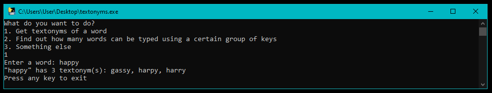
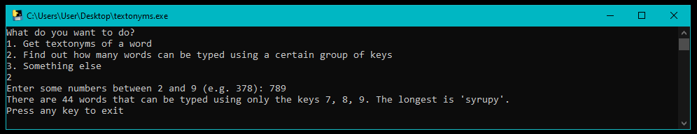
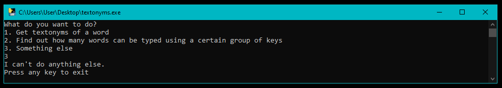

# textonyms

textonyms is a Windows command line program that lets you explore textonyms - pairs of words that can be input using the same key combinations on a mobile phone keypad.

## How to install and use

Just copy textonyms.exe from the dist directory to any folder on your computer and run.

## What it can do

It can find all the textonyms of a word that you specify.

It can tell you about words that can be input using a set of number that you specify.

It can't do anything else.

